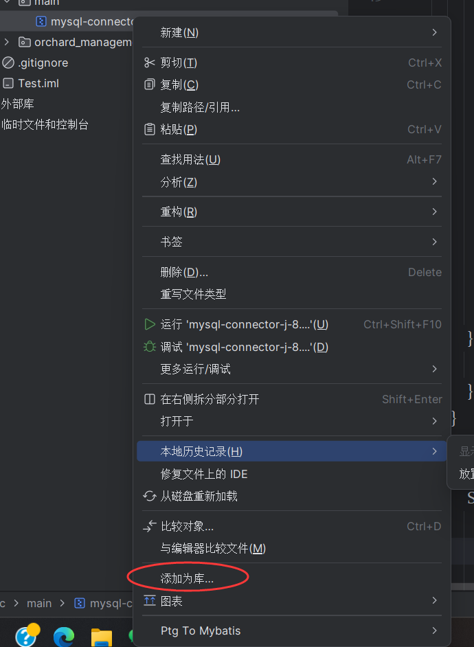
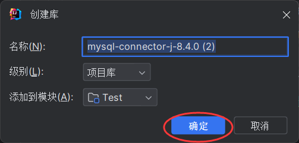
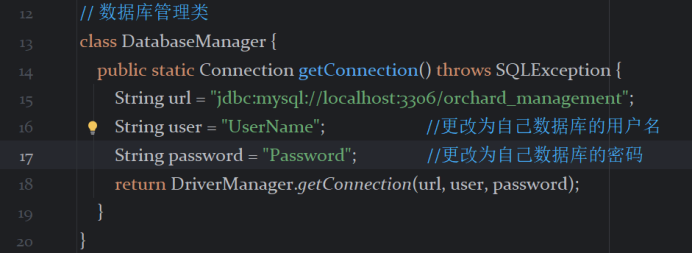

# 注意事项：

## 1.主要代码部分在src文件下的orchard_management包中:
## 2.需要自己创建数据库:

我用的mysql，数据库代码是项目里的.SQL文件，数据库内的数据是项目里的.txt文件,直接粘贴运行即可，编译器使用的是SQLyog（我们老师用的那个）

## 3.mysql-connector-j-8.4.0.jar怎么使用
如果以下方法还是不能成功连接数据库，可以在b站上搜索如何使用jdbc连接数据库自行学习
### 1.idea使用方法为
右键点击mysql-connector-j-8.4.0.jar文件，点击图片中的添加到库

然后弹出下面窗口，名称任意，直接点确定即可

### 2.eclipse的使用方法请在b站或其他地方自行查找
## 4.修改数据库自身账户和密码：

创建好数据库后注意修改自身数据库用户名与密码，只需修改这两个即可，URL一般不需要修改

不知道自己用户名密码，请上网搜索

## 5.运行时问题：

我用的idea，其他编译器不清楚，idea运行时报错表不存在等关于数据库的问题，不用管，直接运行即可，观察数据库是否有更改
